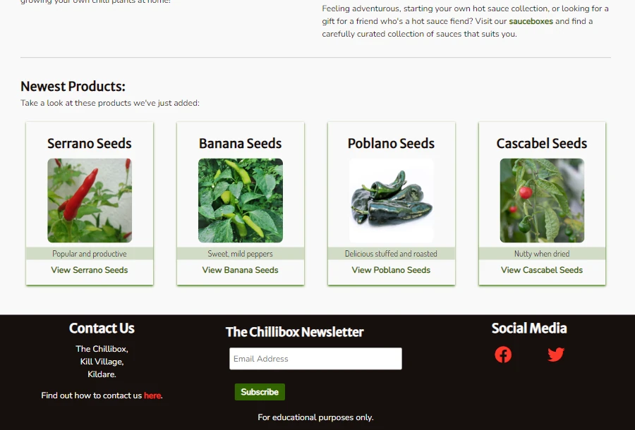
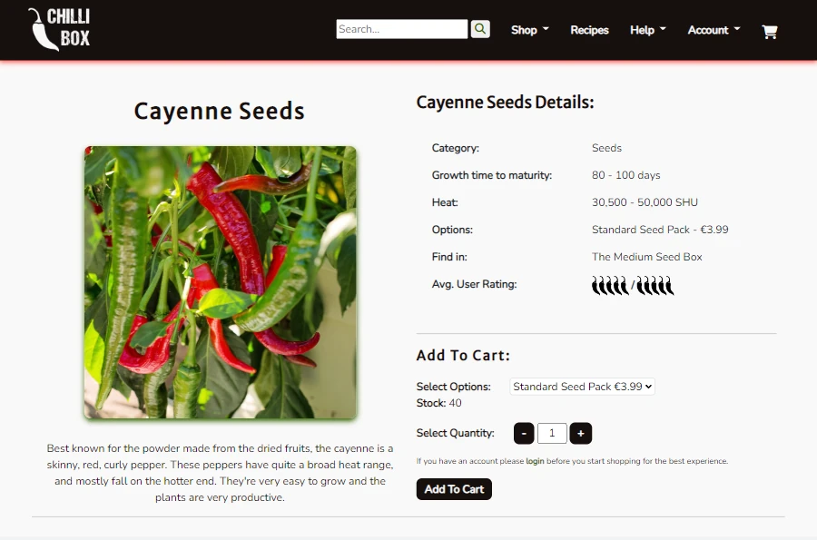
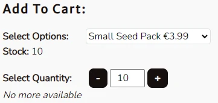
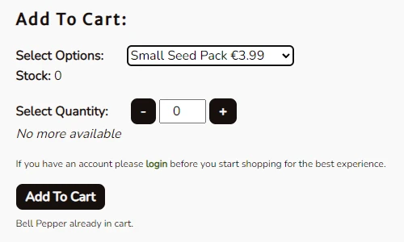
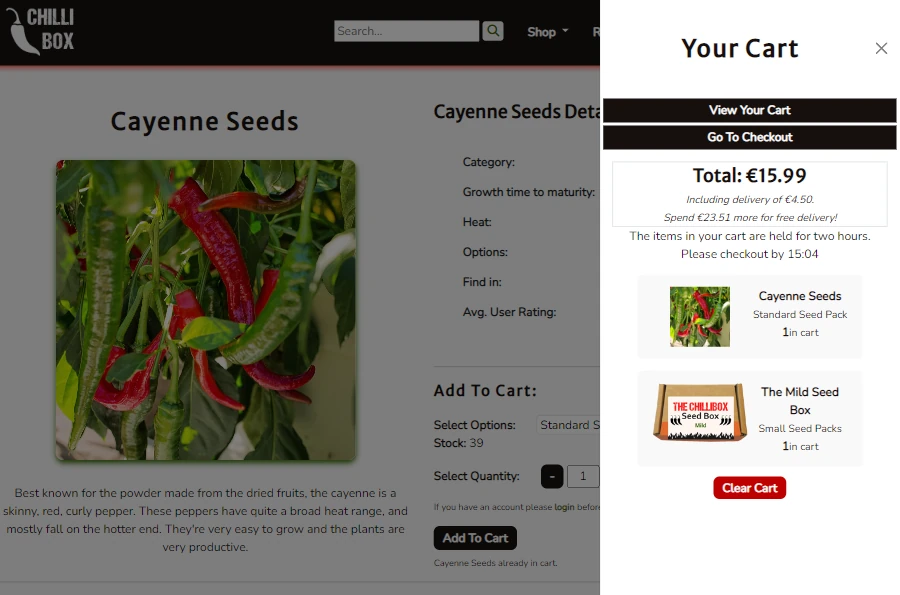

# The Chillibox

The Chillibox is an e-commerce website offering chilli pepper seeds and hot sauces for users to purchase.

Users can register with the site to save their details, view their order history and interact with other features of the website. There is a newsletter available for all users to subscribe to. The website also features reviews and a recipe section to provide further interactivity for users.


The live site is available here: [The Chillibox](https://ci-pp5-the-chillibox.herokuapp.com/).

# Table of Contents
- [Features](https://github.com/SJECollins/ci-pp5-the-chillibox#features)
- [Agile Methodology](https://github.com/SJECollins/ci-pp5-the-chillibox#agile-methodology)
- [Design](https://github.com/SJECollins/ci-pp5-the-chillibox#design)
- [Technologies Used](https://github.com/SJECollins/ci-pp5-the-chillibox#technologies-used)
- [Testing](TESTING.md)
- [Deployment](https://github.com/SJECollins/ci-pp5-the-chillibox#deployment)
- [Credits](https://github.com/SJECollins/ci-pp5-the-chillibox#credits)


# Features
## General

This section discusses the more generic features available throughout the site for all users of the website.

### Navigation Bar
<details>
<summary>Navigation Bar</summary>


</details>

The navigation bar is featured across all pages. The navbar is a slightly modified version of the first example from [Bootstrap's navbar documentation](https://getbootstrap.com/docs/5.2/components/navbar/). It includes drop down menus for "Shop", "Help" and "Account", a link to "Recipes" and a cart icon. It also features the website's logo and a search bar.

The logo in the navbar is visible on all sized screens and links to the home page as user's expect so that it is quick and easy to return to the index from any page on the site.

The search bar is featured in the navbar to make it accessible from any page on the site so that a user can quickly search for a product whenever they want, however it is only immediately visible on larger screens. On smaller screens it is available in the collapsible menu through the navbar toggle to reduce clutter on the screen.

The shop drop down menu is available to all users and features links related to products. It includes a link to "Latest Products" and a link for each category of "Seeds", "Sauces", "Seedboxes" and "Sauceboxes". 

The recipes link is available to all users and links to the recipes page. It is just a simple link to a section of the website that is geared towards user engagement. It was decided to give it its own link rather than include it in one of the drop down menus as it has a goal which doesn't quite fit with the other themes, and is important enough that it could be considered a feature that would drive traffic to the website on its own.

The help drop down menu is available to all users and features links related to customer help and support. It includes links to the "FAQ", "Privacy Policy" and "Contact Us" pages.

The account drop down menu is available to all users but the links available is related to the authentication status of the user and whether the user is staff or not when they are logged in. For users who are not logged in, the links in "Login" and "Register". For users who are logged in but who are not staff, the links available include "My Profile" and "Logout". And for users who are logged in and who are staff, the links available are the same as for not staff but also include "Management".

The above links - "Shop", "Recipes", "Help", and "Account" - are visible on larger screens. On smaller screens the navbar collapses and these links are then accessible through the menu toggle.

The cart icon on the far right of the navbar acts as a toggle for the cart offcanvas element. It is a simple icon, which will display the number of items in the cart but otherwise is kept simple and clean.


### Footer
<details>
<summary>Footer</summary>


</details>

The footer is featured across all pages on the website. It includes three simple sections related to customer communication, offering ways for the customer to communicate with the business.

The first section, "Contact Us", includes the address of the business, but then features an inline link to the contact page and encourages the user to visit that page to find all the other ways they can contact the business.

The second section includes the newsletter subscription form. It's a very simple form that only requests the user's email address to sign up.

The third section features social media links for the user to find the business on Facebook and Twitter.


### Index Page
<details>
<summary>Index Page</summary>


</details>

The index or home page appears the same for all users. It features a carousel at the top of the page, visible to the user immediately upon landing on home page. The carousel currently includes three images. The first is a simple hero image with the business's name. The second is an image that advertises the hot sauce products with a link to the page. And the third is an image advertising the chilli plant seeds with a link to that page. Immediately below the carousel is the website's welcome message for the user.

The next section of the site includes text that briefly introduces the products available to the user on the website. Each short paragraph includes an inline link to the category it is referencing. 

And finally, at the bottom of the index page is a section for the "Newest Products" on the website. This section features four of the products most recently added to the website. They are displayed in "cards" with a thumbnail of the product, a short excerpt of the product's description, its stock status and the product's name as a link to its page.

Overall, the index page is intended to be engaging, informative without overwhelming the customer, and to encourage the user to explore the website further.


### Contact Page
<details>
<summary>Contact Us</summary>


</details>

The contact page is available through a link in the "Help" drop down menu in the navbar and an inline link in the "Contact Us" section of the footer. It is also reachable through other inline links in other pages of the website, for example the review section on product pages includes a sentence with an inline link to this page that encourages users to visit the contact page if they have any concerns as it feels like an appropriate place on the site where user's may wish to reach out to the business.

The contact page is simply laid out. At the top of the page, below the "Contact Us" heading are the contact details for the business. These details include the phone number which allows the user to call the business from their device simply by clicking on it, and the email address which has similar functionality. There is also the full address of the business and the social media links appear here as well.

Below, there is a simple contact form using [EmailJS](https://www.emailjs.com/) for the user to send a message to the business. When submitted, a message is displayed to inform the user that their message has been sent and the business receives the message forwarded in an email by EmailJS.


<details>
<summary>Contact Email Body</summary>


</details>

Finally, there is a google map that indicates where the business is located with a chilli pepper icon.


### FAQ
<details>
<summary>FAQ</summary>


</details>

Under the "Help" drop down menu in the navbar, there is a link to the FAQ page. This page was created to provide additional context for the user for some areas of the business for which they may have questions or be curious about. While the use of text was intended to be minimal across the majority of the website, occasionally users may wish to learn more about certain aspects of the site or have questions for which the answer is not appropriate to place in other areas of the website. The benefit of having a dedicated section like an FAQ is the ability to expand upon it in the future in case the business discovers there are certain questions they receive frequently from users.

The layout of the FAQ page is extremely simple with an emphasis on legibility. The questions and answers are featured in [Bootstrap Accordion](https://getbootstrap.com/docs/5.2/components/accordion/) elements organised under headings to make the questions on the page easy for the user to sift through to find the ones most relevant to them. When a user finds the question they are looking for, they can simply tap to reveal the answer.


### Privacy Policy
<details>
<summary>Privacy Policy</summary>


</details>

Also under the "Help" drop down menu in the navbar is a link to the website's privacy policy. It is a simple privacy policy generated with [Privacy Policy Generator](https://www.privacypolicygenerator.info/).


## Products

This section discusses the features related to the products app. 

### Product Card
<details>
<summary>Product Card</summary>


</details>

A feature used in "Newest Products", "Latest Products" and on the category pages, a product "card" has a box shadow to contain and highlight the individual product. The card features a simple summary of the products details: the name, a thumbnail image, a short excerpt of the product description, the product's stock status and a link to go to the product page. 

The intention behind displaying products like this in the sections mentioned above was partly inspired by the [Bootstrap Card](https://getbootstrap.com/docs/5.0/components/card/) element and to limit the information provided for products outside of the product detail page. Only the most essential information needs to be available. The name is obviously important, especialy if it is what the user is searching for. The image is present to draw the user in visually and the excerpt to try to catch the user's attention. The stock information is obviously important as you don't want the user to go to the product page only to find it out of stock, which would be frustrating. And then, of course, the link so the user can access the product page.

Some consideration was put into a "Quick Add" feature for users on the card, but as most products have different variants it was decided to forgo that feature currently.


### Newest Products
<details>
<summary>Newest Products</summary>


</details>

The most immediate area of the website related to products is the "Newest Products" section on the index page. As described in the "Index Page" feature description above, it displays four of the products most recently added to the website. Its intention is to highlight recently added products, to push them to the front of customers' minds. Users may come to the site with a particular products in mind, but hopefully by advertising newer products on the home page it will encourage users to look at these products as well. For regular users who may be visiting the site for reasons other than an immediate purchase (e.g. browsing, reading recipes) the hope is that they would take a quick look at the "Newest Products" when they visit and find something new they are interested in.

The products are displayed in "Product Cards" which are discussed in the section of the same name above.


### Latest Products
<details>
<summary>Latest Products</summary>


</details>

Similar to the "Newest Products" section of the index page, the first link under "Shop" is "Latest Products". And like the "Newest Products", this page displays four of the most recently added products, but in each category so a broader range of products may be featured. Again, the intention is to highlight recently added products to give them a boost. While it would be possible to filter individual category pages to display by recently added, and may be necessary in the future if the number of categories were to grow, the latest product page allows the user to simply click a link and view recently added products in all categories on one page. 

The products are displayed in "Product Cards" which are discussed in the section of the same name above.


### Categories
<details>
<summary>Categories</summary>


</details>

The category pages are featured on the "Shop" drop down menu on the navbar. There is a link for each category - "Seeds", "Sauces", "Seedboxes" and "Sauceboxes". 

There is a single, simple category template that is used for every category page so that all of these pages have the same layout and are easy to understand for the user. The layout is very simple, the products are displayed in "Product Cards" as described in the section of the same name above, in rows of up to four on larger screens.

There is a simple filter functionality on the category pages which filters the page by subcategory. Almost all products fall within one of "Mild", "Medium", "Hot", and "Mega Hot" subcategories which the user can filter by selecting the subcategory from the drop down menu and clicking "Go".


### Product Detail Page
<details>
<summary>Product Page</summary>


</details>

The product detail page has two main sections, the second of which is the product reviews and is discussed in more detail later on in the "Reviews" features.

The first section on this page features all of the products details. The template used for this page is used for all products so that all product detail pages have a similar layout. Similarly, one product model is used for all products with the choice of fields used depending on the type of product. For example, a basic seed product does not require the "ingredients" field to be filled out and, likewise, a hot sauce does not need "growth time". So, the template uses multiple if statements within tables to display a very similar layout for all products to keep a uniform look to the website.

The first part of the product detail page is the section including the product name, the product image and the product description. Then we have the product's details in a table, which includes different information depending on which type of product the user is viewing. This table may include: the product category, heat level, growth time, ingredients, box contents, box in which the product appears, and rating. These details are dependent on factors such as the type of product, whether it has been reviewed, and whether the staff member who entered the product remembered to fill in the field.

The final part of this section of the product detail page is the "Add To Cart" form, which will be discussed in more detail in "Product Variants" and "Cart" features below. Briefly, it allows the user to select which variant of the product they wish to purchase, the quantity, and to add it to their card.


### Product Variants
<details>
<summary>Variants</summary>


</details>

The product's variants are displayed twice on the product detail page. First in the product details table with the heading "Options" and then in the "Select Option" drop down menu in the "Add To Cart" form element. 

The variant model is related to the product model in a one-to-many relationship where each product can have multiple variants for the user to choose from. Where the product model holds the basic information for each product on the site, the related variant model allows for management of options, prices and stock for products. 

When a user selects a variant in the "Add To Cart" form element, the current stock of that variant of the product is then displayed for the user.


### Box Contents
<details>
<summary>Box Contents</summary>


</details>

"Box contents" is a field in the product model which is used for seedboxes and sauceboxes. It is a many-to-many field related to "self", meaning the product model itself, so that a seedbox contains many seed products, for exmaple.

On a box product page, the products included are shown in the product detail table with the heading "Contents". These are the products the user will receive if they order the box. And then the variants of this box products manages the sizes of the included products and the price of the box, like other products.

If a product is included in a box, when you visit that product's page you will see a line in the table called "Find in" which indicates which box that product is included in. An example of this can be seen in the image above in "Product Variants".


## Cart

This section discusses the features associated with the cart app and the functionality involved with managing the user's cart.

### Add To Cart
<details>
<summary>Product Added</summary>


</details>

The "Add To Cart" functionality of the product detail page is one of the most important features of the website, as expected of an e-commerce site. As previously mentioned in the section about "Product Variants", the form element for adding a product to the cart is dependent on the user selecting a variant of the product.

Prior to selecting an option, the "Add To Cart" button is disabled to prevent the user from submitting the form erroneously. This is controlled through a simple event listener in the javascript calling a function that enables/disables the button depending on whether the user has selected the "Select an option" option in the drop down menu. When the user selects a product variant to add to the cart, the button is then activated and the user is able to add the variant they selected to their cart, depending on availability.
```
    const addBtn = document.getElementById("add")  # Where "add" is the button id
    function updateStock() {
        currentStock = stock.textContent
        if (currentStock == "") {
            addBtn.disabled = true
            warning.style.display = "none"
        } else if (currentStock <= 0) {
            quantity.textContent = 0
            warning.style.display = "block"
            addBtn.disabled = true
        } else {
            quantity.textContent = 1
            warning.style.display = "none"
            addBtn.disabled = false
        }        
    }
```
Also, when the user selects a variant in that drop down menu, the "Stock" field in the form element is then filled with the current stock of that variant of the product. The quantity of that variant that the user is able to add to their cart is dependent on the stock available, which is plainly visible to the user. 
<details>
<summary>Add Max To cart</summary>


</details>

When a variant is initially in stock and the user then goes to add the maximum available to their cart, the quantity buttons disable when they reach the limit (there is also functionality in place to prevent the user selecting a quantity below 0). At the same time, a message is displayed below the quantity field to alert the user in case they do not realise they have reached the limit and that there are no more available.

<details>
<summary>Not Available</summary>


</details>

If a user selects away from this option after adding to cart and then selects it again or comes across a variant on another product that is not in stock, when they select that variant the stock field displays "0", the select quantity field displays "0", they are unable to change the quantity, the "No more available" message is displayed and the "Add To Cart" functionality is disabled.

The ability to alter functionality of the "Add To Cart" form element based on user selections in vanilla JavaScript is achieved through the use of a MutationObserver as based on code from [MDN Web Docs](https://developer.mozilla.org/en-US/docs/Web/API/MutationObserver)
```
    const config = { childList: true }
    const callback = (mutationList, observer) => {
        for (const mutation of mutationList) {
            if (mutation.type === 'childList') {
                updateStock()
                } else {
                console.log(mutation.type)
            }
        }
    }
    const observer = new MutationObserver(callback)
    observer.observe(stock, config)
```
Stock has been mentioned quite a bit in this section, but for brevity will be discussed later in the "Stock" section of the "Management" features.


### Cart Offcanvas
<details>
<summary>Cart Offcanvas Empty</summary>


</details>

Based on the [Bootstrap Offcanvas](https://getbootstrap.com/docs/5.2/components/offcanvas/) element, the condensed cart that the user can toggle is designed to have a simple display and limited functionality. 

When the user toggles the cart open, there is a simple heading of "Your Cart" with an "X" next to it to allow the user to close the cart again. Below the heading are two links, one which brings the user to the full cart page and another that goes directly to the checkout.

When the cart is empty, the link to go to the full cart page will bring the user to that page, but the "Go To Checkout" link redirects the user to the index page with a message of "There's nothing in your cart at the moment." Also, when the user's cart is empty the body of this element simply states "Your cart is empty."

<details>
<summary>Cart Offcanvas With Item</summary>


</details>

When the user has items in their cart, the cart offcanvas element displays a small box related to user's cart total and delivery immediately below the links. This box displays the total in the cart in a large font and below that information regarding the delivery costs (or if there is no delivery cost applicable as the user has reached the threshold).

Following the total and delivery costs, is a short message to the user to alert them that there is a time limit for checkout. The user is given two hours from when they last added an item to their cart during which the items will be held for them, but after which their cart will be emptied and the items will be restocked. This will be discussed further in the "Stock" section of the "Management" features. 

Below this, short summaries of the items in the cart are displayed. The information includes the thumbnail, name of the product, size select and quantity. Below the list of items is the button to clear the cart.

Within this cart offcanvas element there are no options to adjust the quantity of the items within the cart or to remove individual items. It was decided to leave this functionality to the full cart page to reduce clutter in this element as it is intended as brief summary of the most important elements of the user's impending order. The only CRUD functionality available on this element is the "Clear Cart" button due to the simplicity of it.


### Cart
<details>
<summary>Cart</summary>


</details>

The cart page features a summary on the left hand side or top of the page depending on the size of the user's device. On the right hand side or below the summary is a more details list of the items in the user's cart.

The cart summary is a simple table with rows displaying the details of the user's order. It starts with the total number of items in the cart. Then there is a list of each item with their name, quantity, size and price. This is followed by the total if the item prices, the delivery cost and the grand total. Below the table a message is displayed alerting the user to how much more they have to spend to get free delivery, unless they have already reached this. Under this are the "Clear Cart" and "Checkout" buttons.

The item list is on the right of the page on larger screens or below the summary on smaller screens. Here, the user is able to adjust the quantity of the items in the cart or remove the item entirely.


### Adjust Cart
<details>
<summary>Adjust Cart</summary>


</details>

For each item on the cart page there is the ability to adjust the quantity of the item in the cart. This required slightly different code than was used for the "Add To Cart" form element as here the variant is already selected, but the idea is still the same where the user has to be prevented from adding a quantity greater than the actually number in stock. When the user adjusts the quantity and clicks "Update" they can see that the number has changed, but there is also a small confirmation message that appears to provide additional feedback.

Again for brevity and to try to keep features and concepts contained, the stock feature will be discussed further in "Management" features.


### Remove From Cart
<details>
<summary>Remove From Cart</summary>


</details>

Along with adjusting the quantity of items in the cart, the cart also has a "Remove" feature for each item present in the cart. This is a very simple function that deletes the item from the cart and gives the user a confirmation message. When the item is removed from the user's cart it is restocked and they can add it to their cart again if they change their mind.


### Clear Cart
<details>
<summary>Clear Cart</summary>


</details>

The clear cart feature is an expansion on the "Remove" function. More extreme, the user is able to empty their entire cart and begin again with their shopping if they choose. They receive a short message stating that their cart is cleared. The items that were in their cart are then restocked.

## Purchasing

This section discusses the features related to the checkout app and the functionality involved with user purchases on the site.

### Checkout
<details>
<summary>Checkout Empty Form</summary>


</details>

To reach the checkout page, the user can click on the link in the cart offcanvas element or on the "Checkout" button below the summary table on the cart page.

The checkout page has two sections. To the left or on top, depending on the size of the user's device, is the summary of the order. Similarly to the cart page, this summary is a simple table listing the most relevant details of the items in the order. It includes small thumbnails of the items as well as the name just to be clear to the user what they are purchasing. Below this is the delivery cost and grand total.

On the right of or below the order summary, is the form for delivery details. It appears slightly differently depending on whether the user is logged in or not, and whether their details are already saved. For a guest user the form will appear blank. If the user is logged in but has not saved their details previously, the email field will be prepopulated and at the bottom of the form is an option to save their details to their profile.

<details>
<summary>Checkout Filled Form</summary>


</details>

If the user has previously had their details saved to their profile, these details will be prepopulated in the form fields when the user loads the checkout page. Any changes the user makes to their details in the form can be saved by selecting the save option when they submit the form

Directly below the delivery details is the [Stripe](https://stripe.com) card element where the user inputs their card details to complete the order.

For the delivery form and Stripe elements, the code is based on Code Institute's [Boutique Ado](https://github.com/Code-Institute-Solutions/boutique_ado_v1) project.


### Complete Order
<details>
<summary>Checkout Success</summary>


</details>

### Order Confirmation

<details>
<summary>Order Confirmation Email</summary>


</details>

### Order PDF

## User Profiles

### User Profile
<details>
<summary>User Profile</summary>


</details>

### Your Reviews
<details>
<summary></summary>


</details>

### Your Recipes
<details>
<summary>User Recipes</summary>


</details>

## Reviews

### Product Reviews
<details>
<summary>No Product Reviews</summary>


</details>

<details>
<summary>Product Review</summary>


</details>

### Product Ratings


## Recipes

### Recipes
<details>
<summary></summary>


</details>

### Recipe Comments
<details>
<summary></summary>


</details>

## Management
### Products
<details>
<summary></summary>


</details>

### Stock
<details>
<summary></summary>


</details>

### Reviews
<details>
<summary></summary>


</details>

### Recipes
<details>
<summary></summary>


</details>

### Submitted Recipes
<details>
<summary></summary>


</details>

### Comments
<details>
<summary></summary>


</details>

## Admin

# Agile Methodology
## Epics, User Stories

The project board can be found [here](https://github.com/users/SJECollins/projects/6).

Below are the Epics and their User Stories used to shape the creation of the project. Each are linked to their respective version on the project board, where the acceptance criteria, MoSCoW prioritisation labelling and comments can be found.

### [Navigation](https://github.com/SJECollins/ci-pp5-the-chillibox/milestone/1):
  - Site users should be able to navigate through the site intuitively using the navigation bar and clearly marked links so that they can find the products that they are looking for.
  - User Stories:
    - 1: [View Latest Products](https://github.com/SJECollins/ci-pp5-the-chillibox/issues/2)
      - As a site user I can navigate to latest products so that I can view the most recent products added to the site
    - 2: [Products By Category](https://github.com/SJECollins/ci-pp5-the-chillibox/issues/3)
      - As a site user I can navigate to products by category so that I can view all products available in that category
    - 3: [Product Page](https://github.com/SJECollins/ci-pp5-the-chillibox/issues/4)
      - As a site user I can view an individual product's page so that I can see the product's details and have the option to add to my cart
    - 4: [Search Products](https://github.com/SJECollins/ci-pp5-the-chillibox/issues/5)
      - As a site user I can enter a search term so that I can find products that I am interested in
    - 5: [Sort Category](https://github.com/SJECollins/ci-pp5-the-chillibox/issues/6)
      - As a site user I can sort categories so that I can view products in a category by other criteria


### [Cart](https://github.com/SJECollins/ci-pp5-the-chillibox/milestone/2)
  - Site users should be able to add products in various quantities to their cart. They should be able to view items in the cart, adjust the quantities and remove items from the cart
  - User Stories:
    - 6: [Add To Cart](https://github.com/SJECollins/ci-pp5-the-chillibox/issues/7)
      - As a site user I can click "add to cart" so that I can add a product to my cart
    - 7: [Adjust Quantity](https://github.com/SJECollins/ci-pp5-the-chillibox/issues/8)
      - As a site user I can adjust quantities of products in my cart so that I can change the quantity of the product that I wish to purchase
    - 8: [Remove From Cart](https://github.com/SJECollins/ci-pp5-the-chillibox/issues/9)
       - As a site user I can click "remove" on a product in my cart so that the product is removed from my cart
    - 9: [Product Options](https://github.com/SJECollins/ci-pp5-the-chillibox/issues/10)
      - As a site user I can clear my cart so that all items are removed from the cart
    - 10: [Clear Cart](https://github.com/SJECollins/ci-pp5-the-chillibox/issues/11)
      - As a site user I can choose an option/variant of a product so that option is added to my cart
    - 11: [Already In Cart](https://github.com/SJECollins/ci-pp5-the-chillibox/issues/12)
      - As a site user I can see on a product's page if the product is already in my cart so that I know if I have already added the product to my cart without having to go through the cart itself


### [User Registration](https://github.com/SJECollins/ci-pp5-the-chillibox/milestone/3):
  - Site users are able to register with the site and create a profile that saves their contact and delivery information. The user should be able to update the information in their profile. The user should be able to view their previous orders from their profile
  - User Stories:
    - 12: [Registration](https://github.com/SJECollins/ci-pp5-the-chillibox/issues/13)
      - As a site user I can register with the site so that I can create a user profile with the site
    - 13: [Login](https://github.com/SJECollins/ci-pp5-the-chillibox/issues/14)
       - As a site user I can login if I am registered so that I can use features available for registered users, e.g. view and edit profile
    - 14: [Logout](https://github.com/SJECollins/ci-pp5-the-chillibox/issues/15)
      - As a site user I can logout so that I can logout from the site
    - 15: [Update Profile](https://github.com/SJECollins/ci-pp5-the-chillibox/issues/16)
      - As a site user I can edit my profile so that I can update my personal details
    - 16: [Delete Profile](https://github.com/SJECollins/ci-pp5-the-chillibox/issues/17)
      - As a site user I can delete my profile so that my personal details are removed from the site
    - 17: [Order History](https://github.com/SJECollins/ci-pp5-the-chillibox/issues/18)
      - As a site user I can view my order history so that I can review previous purchases
    - 18: [Order Again](https://github.com/SJECollins/ci-pp5-the-chillibox/issues/19)
      - As a site user I can click "order again" on an item from my order histroy so that I can easily order items I have ordered previously.


### [Checkout](https://github.com/SJECollins/ci-pp5-the-chillibox/milestone/4)
  - User should be able to checkout using their card and provided delivery details. A user should receive confirmation and an order should be generated, and added to their order history if registered.
  - User Stories:
    - 19: [Checkout](https://github.com/SJECollins/ci-pp5-the-chillibox/issues/20)
      - As a site user I can go to checkout so that I can complete my purchase
    - 20: [Review Order](https://github.com/SJECollins/ci-pp5-the-chillibox/issues/21)
      - As a site user I can review my order prior to checkout so that I can be confident I am ordering the items I actually want
    - 21: [Delivery Details](https://github.com/SJECollins/ci-pp5-the-chillibox/issues/22)
      - As a site user I can enter/update my delivery details prior to checkout so that I can provide the correct delivery and contact information
    - 22: [Checkout With Card](https://github.com/SJECollins/ci-pp5-the-chillibox/issues/23)
      - As a site user I can enter my card details on the site so that I can chekcout using my card
    - 23: [Order Summary](https://github.com/SJECollins/ci-pp5-the-chillibox/issues/24)
      - As a site user I can view an order summary so that I can review my order after it is placed


### [Reviews](https://github.com/SJECollins/ci-pp5-the-chillibox/milestone/5)
  - Users should be able to review and rate products on the website. The reviews and ratings should be displayed on the product page. Registered users who publish reviews while logged in should be able to view, edit and delete their reviews.
  - User Stories:
    - 24: [Create Review](https://github.com/SJECollins/ci-pp5-the-chillibox/issues/25)
      - As a site user I can create a review on a product page so that I can provide feedback on the product
    - 25: [View Reviews](https://github.com/SJECollins/ci-pp5-the-chillibox/issues/26)
      - As a site user I can view reviews on a product so that I can see other users feedback
    - 26: [View Own Reviews](https://github.com/SJECollins/ci-pp5-the-chillibox/issues/27)
      - As a registered site user I can view the reviews I have written in my profile so that I can easily access the reviews I've written
    - 27: [Edit Review](https://github.com/SJECollins/ci-pp5-the-chillibox/issues/28)
      - As a registered site user I can edit a review I have written so that I can update a review
    - 28: [Delete Review](https://github.com/SJECollins/ci-pp5-the-chillibox/issues/29)
      - As a registered site user I can delete my review so that my review is removed from the site


### [Management Dashboard](https://github.com/SJECollins/ci-pp5-the-chillibox/milestone/6):
  - The site should contain a dashboard for staff to manage products without requiring staff to login to Django's admin dashboard. There should be limited functionality to allow staff to add, edit and delete products from this view, as well as manage stock.
  - User Stories:
    - 29: [View Management Dashboard](https://github.com/SJECollins/ci-pp5-the-chillibox/issues/30)
      - As an admin user I can access a dashboard through the navbar so that I can access product management features without having to login in to Django's admin
    - 30: [View Products](https://github.com/SJECollins/ci-pp5-the-chillibox/issues/31)
      - As an admin user I can view a table of the products available on the site so that I can review the available products and access management features for them
    - 31: [Add Product](https://github.com/SJECollins/ci-pp5-the-chillibox/issues/32)
      - As an admin user I can access a form to add a new product from the management dashboard so that I can add new products to the site
    - 32: [Edit Product](https://github.com/SJECollins/ci-pp5-the-chillibox/issues/33)
      - As an admin user I can edit existing products from the management dashboard so that I can update/change existing products
    - 33: [Delete Product](https://github.com/SJECollins/ci-pp5-the-chillibox/issues/34)
      - As an admin user I can delete a product so that I can remove the product from the site
    - 34: [Update Stock](https://github.com/SJECollins/ci-pp5-the-chillibox/issues/35)
      - As an admin user I can update stock from the management dashboard so that the stock of available products is changed on the site


### [Home](https://github.com/SJECollins/ci-pp5-the-chillibox/milestone/7):
  - The home app provides users with vasic views for the site such as the index and contact pages, to introduce the user to the site and products, and provide contact information
  - User Stories:
    - 35: [View Index](https://github.com/SJECollins/ci-pp5-the-chillibox/issues/36)
      - As a site user I can view the index page so that I can learn about and understand the site
    - 36: [View Contact Page](https://github.com/SJECollins/ci-pp5-the-chillibox/issues/37)
      - As a site user I can navigate to the contact page so that I can access the contact details for the business
    - 37: [Location Details](https://github.com/SJECollins/ci-pp5-the-chillibox/issues/38)
      - As a site user I can see an address and map on the contact page so that I can find the location of the business if required
    - 38: [Contact Form](https://github.com/SJECollins/ci-pp5-the-chillibox/issues/39)
      - As a site user I can use a contact form on the contact page so that I can contact the business easily


### [Recipes](https://github.com/SJECollins/ci-pp5-the-chillibox/milestone/8):
  - The site should contain a recipe section with recipes created by the site admin/staff for users to browse. Users should be able to comment on the recipes. Users may be able to submit recipes in some form, but not directly post recipes to the website as they should be curated by the admin.
  - User Stories:
    - 39: [Create Recipe](https://github.com/SJECollins/ci-pp5-the-chillibox/issues/40)
      - As an admin user I can create recipes so that I can publish them on the website for users to read
    - 40: [Edit Recipe](https://github.com/SJECollins/ci-pp5-the-chillibox/issues/41)
      - As an admin user I can edit recipes so that I can change existing recipes on the website
    - 41: [Delete Recipe](https://github.com/SJECollins/ci-pp5-the-chillibox/issues/42)
      - As an admin user I can delete recies so that they are removed from the website
    - 42: [View Recipes](https://github.com/SJECollins/ci-pp5-the-chillibox/issues/43)
      - As a site user I can navigate to the recipes section so that I can view the recipes available on the site
    - 43: [Add Comment](https://github.com/SJECollins/ci-pp5-the-chillibox/issues/44)
      - As a site user I can add a comment so that I can comment on recipes on the website
    - 44: [Edit Comment](https://github.com/SJECollins/ci-pp5-the-chillibox/issues/45)
      - As a site user I can edit comments so that I can update my comments if necessary
    - 45: [Delete Comment](https://github.com/SJECollins/ci-pp5-the-chillibox/issues/46)
      - As a site user I can delete comments so that I can remove my comments from a recipe
    - 46: [Submit Recipe](https://github.com/SJECollins/ci-pp5-the-chillibox/issues/47)
      - As a site user I can submit recipes so that my recipes can be posted on the website


# Design

## Colour

The colour palette used for the website based on the central red which was colour picked from the main image used on the carousel on the index page. From there, colours were chosen to compliment or contrast, selecting for legibility, simplicity and to stay with the chilli pepper theme. 

<details>
<summary>Colour Palette</summary>


</details>

## Mockups

Initially, the project idea came about during planning for a previous project and mockups were created then. At that stage the project was put aside in favour of another idea that better fit the requirements. At the time, the project was proposed as a subscription box service. It has since changed but the design of the website still shares some similarities visually with the intial mockups.

<details>
<summary>Mock Up One</summary>


</details>

<details>
<summary>Mock Up Two</summary>


</details>

## Wireframes

Wireframes were created in Balsamiq. They were used for initial planning for the layout of the website.

<details>
<summary>Index</summary>


</details>

<details>
<summary>Contact</summary>


</details>

<details>
<summary>Products</summary>


</details>

<details>
<summary>Product Detail</summary>


</details>

<details>
<summary>Cart</summary>


</details>

<details>
<summary>Checkout</summary>


</details>

<details>
<summary>Checkout Success</summary>


</details>

## Entity Relationship Diagrams

<details>
<summary>ERD</summary>


</details>

# SEO and Marketing

# Technologies Used

# Testing

# Deployment

# Credits
