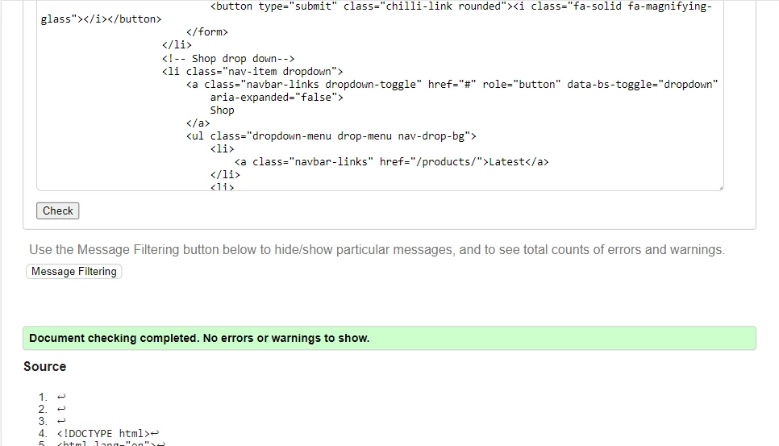

# The Chillibox
# Testing

## Lighthouse

## HTML Validator

HTML was tested through validation by copying the source code of pages into the direct input on [W3C HTML Validator](https://validator.w3.org/#validate_by_input).
Any errors found where then corrected to meet the validator's standards. Below are the results after templates were edited to meet the requirements.

Index

FAQ

Privacy Policy

Latest Products

Category

Product

Profile

Profile Reviews

Profile Recipes

Management Dashboard

Management Reviews

Management Recipes

Management Comments

Management Submitted Recipes

## CSS Validator

No errors were found in the CSS was manually copied into the [W3C CSS Validatory](https://jigsaw.w3.org/css-validator/validator)

    

## JavaScript Testing

## Python Testing

## Automated Testing

## Manual Testing
Below the steps for manual testing of the site have been arranged into tables. User stories are matched to the manual tests which demonstrate their fulfillment in the User Story column. The User Story numbers can be found on the project board under their Epics or in the main README file under Agile Methodology - Epics & User Stories.

The fulfillment of acceptance criteria for user stories is not the focus of the manual testing as this was documented when features were implemented in comments on each user story on the project board.

Manual Testing for User Authentication

Manual Testing for User Profiles

Manual Testing for Home

Manual Testing for Products

Manual Testing for Cart

Manual Testing for Checkout

Manual Testing for Management Pt1

Manual Testing for Management Pt2

Manual Testing for Recipes

## Browser Compatibility

## Bugs
### Fixed Bugs

### Known Bugs