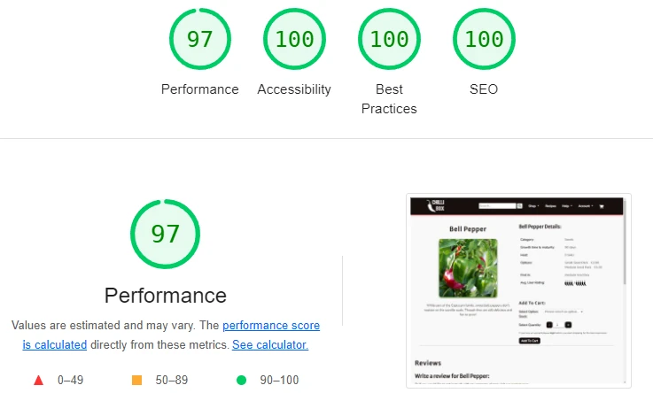

# The Chillibox
# Testing

Below is the testing performed for the project. Wherever possible, screenshots were taken to document the testing.

## Lighthouse

The site was tested using Lighthouse in Chrome DevTools to check performance, accessibiltiy, best practices and SEO. Where possible, errors and warnings were corrected so all final results were a minimum of 90. The final testing on Lighthouse was run on incognito mode. The results are below.

Lighthouse Index

Lighthouse FAQ

Lighthouse Privacy Policy

Lighthouse Contact Us

Lighthouse Recipe List

Lighthouse Recipe Page

Lighthouse Latest Products

Lighthouse Category

Lighthouse Product Page

Lighthouse Cart

Lighthouse Checkout

Lighthouse Checkout Success

Lighthouse Register

Lighthouse Login

Lighthouse User Profile

Lighthouse Profile - User Reviews

Lighthouse Profile - User Recipes

Lighthouse Management Dashboard

Lighthouse Management - User Reviews

Lighthouse Management - Recipes List

Lighthouse Management - Submitted Recipes

Lighthouse Management - Recipe Comments

## HTML Validator

HTML was tested through validation by copying the source code of pages into the direct input on [W3C HTML Validator](https://validator.w3.org/#validate_by_input).
Any errors found where then corrected to meet the validator's standards. Below are the results after templates were edited to meet the requirements.

Index

FAQ

Privacy Policy

Latest Products

Category

Product

Profile

Profile Reviews

Profile Recipes

Management Dashboard

Management Reviews

Management Recipes

Management Comments

Management Submitted Recipes

## CSS Validator

No errors were found in the CSS was manually copied into the [W3C CSS Validatory](https://jigsaw.w3.org/css-validator/validator)

    

## JavaScript Testing

JavaScript validation was performed using [JSHint](https://jshint.com/) to check quality of the JS scripts. During validation the code "/* jshint -W033 *\/" to surpress warnings related to "missing semicolons", and "/\* globals exampleVariable */" was used to surpress warnings related to global variables. There remained two warnings related to "unused variables" in the script for the Google Map.

JSHint Modal

JSHint Product Page Add To Cart

JSHint Cart Adjust Quantity

JSHint Checkout and Stripe

JSHint EmailJS

JSHint Google Map

## Python Testing

Python validation for PEP8 compliance was performed using [pycodestyle](https://pycodestyle.pycqa.org/en/latest/index.html) to check linting errors. Where appropriate, in a small number of cases "# noqa" was used, especially for "errors" in Django generated files. 

[CI Python Linter](https://pep8ci.herokuapp.com/) was used to double check some pages by copy and pasting code, as a back up to confirm there were no linting issues.

Python Problems

## Automated Testing

Automated testig was performed using Django's testing tools and measured using coverage. The pages of the coverage report are below.

Coverage Pg1

Coverage Pg2

Coverage Pg3

## Manual Testing
Below the steps for manual testing of the site have been arranged into tables. User stories are matched to the manual tests which demonstrate their fulfillment in the User Story column. The User Story numbers can be found on the project board under their Epics or in the main README file under Agile Methodology - Epics & User Stories.

The fulfillment of acceptance criteria for user stories is not the focus of the manual testing as this was documented when features were implemented in comments on each user story on the project board.

Manual Testing for User Authentication

Manual Testing for User Profiles

Manual Testing for Home

Manual Testing for Products

Manual Testing for Cart

Manual Testing for Checkout

Manual Testing for Management Pt1

Manual Testing for Management Pt2

Manual Testing for Recipes

## Browser Compatibility

The website was tested on:

- Chrome Version 108.0.5359.125
- Firefox Version 108.0
- Edge Version 108.0.1462.54
- Safari iOS Version 16.1.1

## Bugs
### Fixed Bugs

- Comment options:
    - **Issue**: "Edit" and "Delete" options for comment available for everyone
    - **Description**: On launch, the "Edit" and "Delete" options for every comment was available for everyone. This was due to a error in the if statement of the template checking the user. It check if the user matched the "comment.commenter" when it should have been checking against "comment.user".
    - **Fix**: Edit template to check for "comment.user"

- Accessing profile:
    - **Issue**: Unable to access user profiles
    - **Description**: Following changes to the order model when integrating Stripe webshooks, users were unable to access their profiles and user accounts were unable to be altered in admin. This was due to migrations not being done on the live site.
    - **Fix**: Migrated tables on the live site.

- Stock:
    - **Issue**: Users able to add more items than in stock
    - **Description**: When users added the maximum amount of stock to their cart, they were able to reload the page and even with 0 quantity of a product variant in stock they could add to their cart (but only 1 item). This was due to the "Add To Cart" button not being disabled when a variant was selected.
    - **Fix**: Edit script to check for and disable "Add To Cart" when stock is 0

### Known Bugs
There are currently no known bugs.